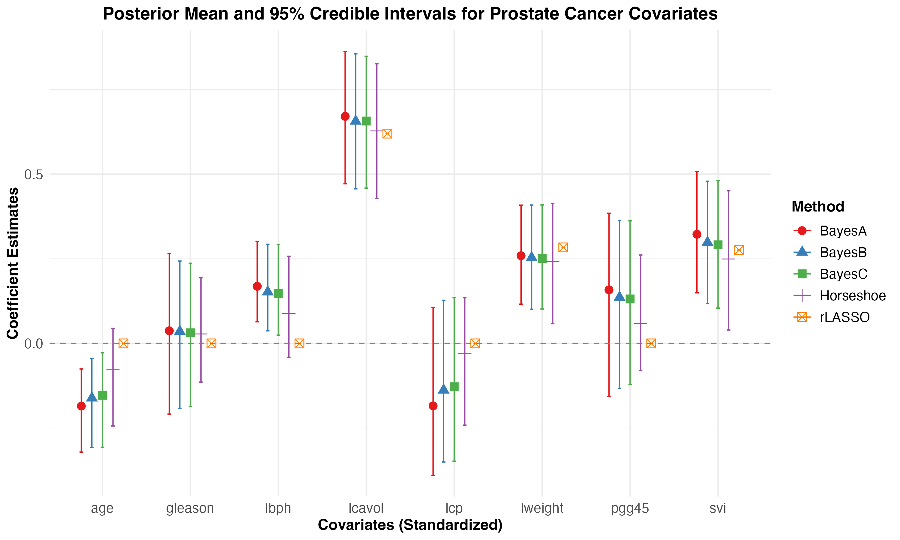
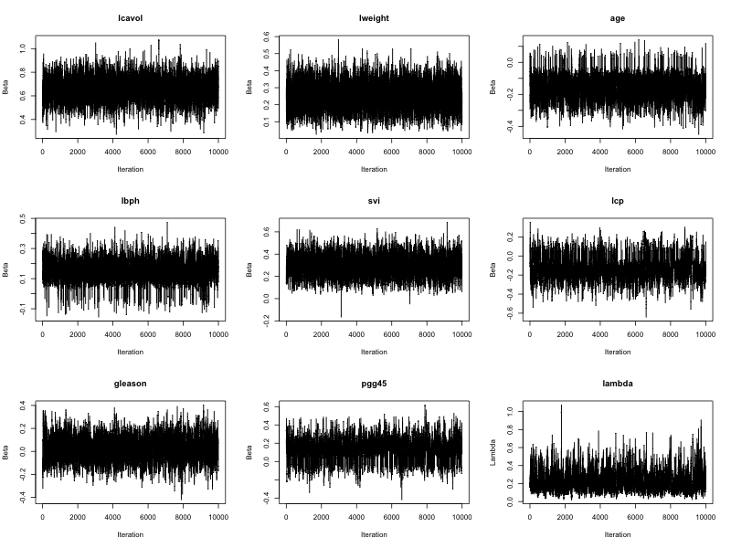

<div align="center">

# rLASSO

### Reciprocal Bayesian LASSO in R

*Pure R · Zero dependencies · Gibbs sampler from scratch*

[](https://www.r-project.org/)
[](LICENSE)
[](https://doi.org/10.1002/sim.9098)

</div>

---

Implementation of the **Reciprocal Bayesian LASSO (rLASSO)** from:

> Mallick H, Alhamzawi R, Paul E, Svetnik V. *The reciprocal Bayesian LASSO.* Statistics in Medicine, 2021; 40(22):4830–4849.

Unlike Lasso/Ridge which penalize large coefficients, rLASSO uses a **decreasing penalty** — enforcing stronger sparsity and achieving oracle properties in both estimation and prediction.

---

## How It Works

### The Regularization Problem

For a linear model $y = X\beta + \epsilon$, $\epsilon \sim N(0, \sigma^2 I_n)$, rLASSO minimizes:


$$
Q(\beta) = \min_\beta \; (y - X\beta)'(y - X\beta) + \lambda \sum_{j=1}^p \frac{1}{|\beta_j|} \, I\{\beta_j \neq 0\}
$$


The penalty $1/|\beta_j|$ grows as $\beta_j \to 0$ — aggressively pushing near-zero coefficients to exactly zero.

### Inverse Double Exponential Prior

The Bayesian counterpart places an **Inverse Laplace** prior on each $\beta_j$:


$$
\pi(\beta) = \prod_{j=1}^p \frac{\lambda}{2\beta_j^2} \exp\{ -\frac{\lambda}{|\beta_j|} \} I\{\beta_j \neq 0\}
$$


### Hierarchical Gibbs Representation

To make posterior sampling tractable, the prior is decomposed as a scale mixture of truncated normals (SMTN):


$$
\beta_j \mid \tau_j, u_j, \sigma^2 \;\sim\; N\left(0,\, \sigma^2 \tau_j^2\right) I\{ |\beta_j| > \tfrac{\sigma}{u_j} \}
$$


$$
\tau_j^{-1} \mid \zeta_j \;\sim\; \text{Inverse-Gaussian}\left( \tfrac{\zeta_j \sigma}{|\beta_j|},\; \zeta_j^2 \right)
$$


$$
\zeta_j \mid u_j \;\sim\; \text{Gamma}\left( 2,\; \tfrac{|\beta_j|}{\sigma} + \tfrac{1}{u_j} \right), \qquad u_j \mid \lambda \;\sim\; \text{Exp}(\lambda)\, I\{ u_j > \tfrac{\sigma}{|\beta_j|} \}
$$


$$
\sigma^2 \;\sim\; \text{Inverse-Gamma}\left( \tfrac{n-1+p}{2},\; \tfrac{R + \beta' T^{-1} \beta}{2} \right) I\{ \sigma^2 < \min_j \beta_j^2 u_j^2 \}
$$


---

## What's Included

```
rLASSO/
├── R/rLASSO.R               ← all samplers and selection utilities
├── data/prostate.data        ← Stamey Prostate Cancer dataset
├── scripts/
│   ├── test_run.R            ← quick sanity check
│   ├── simulation.R          ← benchmark simulation (MSE, BAR)
│   └── real_data_analysis.R  ← prostate analysis + plots
└── results/                  ← generated figures and tables
```

| Function | Description |
| :--- | :--- |
| `BayesRLasso()` | rLASSO Gibbs sampler — BayesA / BayesB / BayesC variants |
| `rrLASSO.S5()` | Frequentist rLASSO via Simplified Shotgun Stochastic Search (S5) |
| `BayesLasso()` | Bayesian Lasso (Park & Casella 2008) |
| `BayesHorseshoe()` | Horseshoe regression (Makalic & Schmidt 2016) |
| `variable_selection_CI()` | Post-hoc selection via credible intervals |
| `variable_selection_FBP()` | Post-hoc selection via fractional Bayes posterior |

---

## Quick Start

**Install the three optional dependencies** (only needed for benchmarks and plots):

```r
install.packages(c("glmnet", "ggplot2", "gridExtra"))
```

**Run:**

```bash
Rscript scripts/test_run.R          # verify all samplers work
Rscript scripts/simulation.R        # MSE/BAR benchmark across 3 scenarios
Rscript scripts/real_data_analysis.R  # prostate cancer analysis + figures
```

---

## Results

### Prostate Cancer Dataset

$n = 97$, $p = 8$ (67 train / 30 test). Out-of-sample MSPE and selected model size:

| Method | MSPE ↓ | Model Size |
| :--- | :---: | :---: |
| Lasso | 0.506 | 7 |
| Adaptive Lasso | 0.506 | 7 |
| Bayesian Lasso | 0.491 | 3 |
| Horseshoe | 0.459 | 2 |
| BayesA (rLASSO) | 0.527 | 5 |
| BayesB (rLASSO) | 0.511 | 7 |
| BayesC (rLASSO) | 0.505 | 7 |
| **rLASSO (S5)** | **0.492** | **2** |

### Coefficient Estimates & 95% Credible Intervals



BayesA/B/C provide automatic uncertainty quantification. Narrow credible intervals concentrate on the top predictors (`lcavol`, `lweight`, `svi`).

### MCMC Convergence — BayesC



Trace plots for $\beta$ and $\lambda$ show excellent mixing and rapid convergence.

### Simulation Study

Three scenarios — mean (SD) over 5 replications:

| | **Scenario 1 (Case I)** | | **Scenario 2 (Case III)** | | **Scenario 3 (Case VIII)** | |
| :--- | :---: | :---: | :---: | :---: | :---: | :---: |
| | MSE | BAR | MSE | BAR | MSE | BAR |
| Lasso | 11.847 (2.616) | 0.968 | 2.745 (0.271) | 0.900 | 12.372 (2.510) | 0.859 |
| Adaptive Lasso | 10.780 (1.859) | 0.989 | 2.451 (0.189) | 0.998 | 13.414 (3.117) | 0.888 |
| Bayesian Lasso | 12.690 (3.354) | 1.000 | 2.935 (0.254) | 0.994 | 12.688 (2.768) | 0.861 |
| Horseshoe | 10.714 (2.020) | 1.000 | 2.504 (0.161) | 1.000 | 12.527 (2.788) | 0.694 |
| BayesA (rLASSO) | 46.922 (14.445) | 0.816 | 8.370 (1.281) | 0.955 | 49.688 (14.862) | 0.763 |
| BayesB (rLASSO) | 12.934 (3.541) | 0.637 | 3.691 (0.485) | 0.824 | 13.513 (2.945) | 0.647 |
| BayesC (rLASSO) | 12.664 (3.656) | 0.632 | 3.722 (0.607) | 0.829 | 13.437 (2.869) | 0.647 |
| rLASSO (S5) | 12.751 (2.584) | 0.821 | 2.880 (0.117) | 0.941 | 13.644 (3.175) | 0.784 |

**Scenarios:** (I) Isotropic design, $n=50$, $p=20$, $\rho=0$, strong sparsity, $\sigma=3$ · (III) AR design, $n=100$, $p=50$, $\rho=0.95$, strong sparsity, $\sigma=1.5$ · (VIII) Compound symmetry, $n=50$, $p=20$, $\rho=0.5$, mild sparsity, $\sigma=3$

---

<div align="center">
<sub>Built on the methodology of Mallick et al. (2021) · Statistics in Medicine · DOI: 10.1002/sim.9098</sub>
</div>
